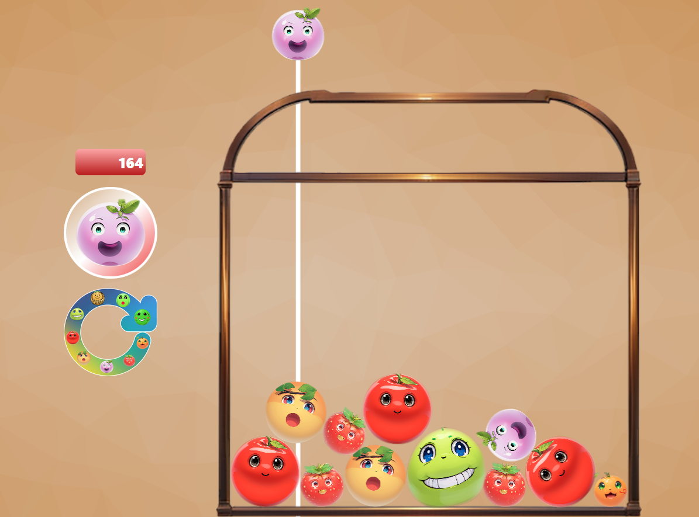

# Showcase

.

## Host

The project is hosted on https://fruitgame.vercel.app/.

# Details

-   This is a [Next.js](https://nextjs.org/) project bootstrapped with [`create-next-app`](https://github.com/vercel/next.js/tree/canary/packages/create-next-app).
-   Uses [Typescript](https://www.typescriptlang.org/) with jsx.
-   Rendering the game is done with the Canvas API.
-   Physics calculations are executed with the [Matter.JS](https://brm.io/matter-js/) physics engine.

## Development

First, run the development server:

```bash
npm run dev
# or
yarn dev
# or
pnpm dev
# or
bun dev
```

Open [http://localhost:3000](http://localhost:3000) with your browser to see the result.

And just start editing 😊.
